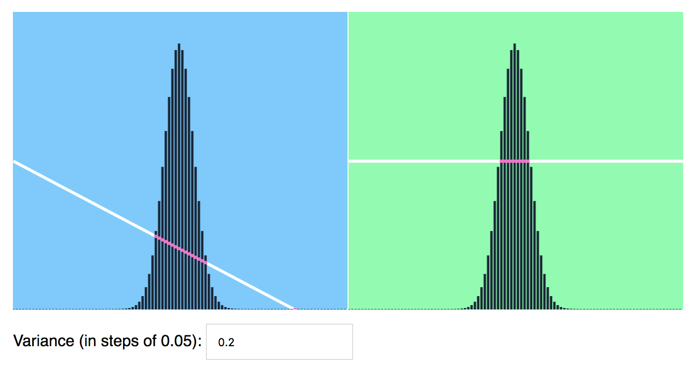

# pts-react-example
This is an example project of using [Pts](https://github.com/williamngan/pts) with [React](https://github.com/facebook/react).

- Take a look at [the demo](https://williamngan.github.io/pts-react-example/build/) 
- Review the code in src folder. (eg, [PtsChart.jsx](https://github.com/williamngan/pts-react-example/blob/master/src/PtsChart.jsx))
- To try it, first download or clone this repo, and then run `npm start`

   

---

### What is Pts?

[Pts](https://github.com/williamngan/pts) is a typescript/es6 library that enables you to compose and visualize points in spaces. Get started at [ptsjs.org](https://ptsjs.org).

---

### Technical notes
Pts is an javascript es6 library that targets modern browsers. If you need es5 to support older browsers, you may need to configure your build tools accordingly. At this stage, the library may not be stable enough for production use.

Some pointers:

- UglifyJS doesn't seem to support extending built-in types unless the code is transformed to es5 first. Alternatively, consider other minify tool such as [babel-minify](https://github.com/babel/minify)

- If you're using babel, you may (or may not) need the [builtin-extend plugin](https://github.com/loganfsmyth/babel-plugin-transform-builtin-extend) because Pts extends built-in types like Array and Float32Array.

If you're an expert in React ecosystem and javascript build tools, please share your thoughts on best practices by posting in [Issues](https://github.com/williamngan/pts-react-example/issues) :) 